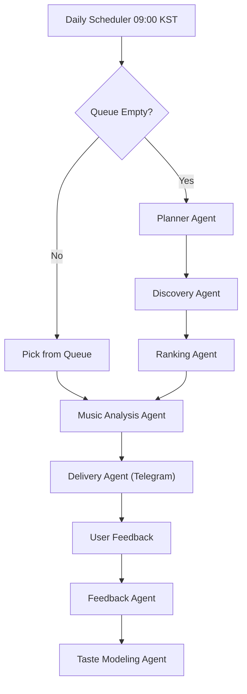

# DailyDig: Daily Music Discovery Agent

DailyDig is an automated music discovery and delivery system that recommends tracks to users daily, learns from their feedback, and adapts to their evolving tastes. It integrates with Spotify, Telegram, and leverages LLM-based analysis to provide a personalized music journey.

---

## Features

- **Daily Recommendations**: Sends a new track every day at 09:00 KST via Telegram.
- **Queue Delivery & Auto-Discovery**: Prioritizes user-imported tracks; falls back to auto-discovery using Spotify recommendations when the queue is empty.
- **Taste Learning**: Continuously updates user taste profiles based on feedback (👍/👎/⏭).
- **Playlist Import**: Import any Spotify playlist to seed your dig queue.
- **Explainable Recommendations**: Provides explanations and score breakdowns for each recommendation.
- **Evaluation Dashboard**: Track system performance and feedback metrics.

---

## System Architecture

### Agent Orchestration Diagram



### Modes of Operation

**Mode A: Queue Delivery** (feed-first)

1. Scheduler triggers at 09:00 KST
2. If dig queue has tracks: pick one, analyze, deliver via Telegram
3. Collect feedback, update taste profile

**Mode B: Auto-Discovery** (when queue is empty)

1. Notify user (switching to auto-discovery)
2. Planner agent selects strategy based on taste
3. Discovery agent fetches candidates from Spotify
4. Ranking agent scores/selects best
5. Analyze and deliver

**Playlist Import Flow**

1. User submits Spotify playlist URL
2. System fetches tracks, deduplicates, adds to queue

**LangGraph Workflow**

The workflow is orchestrated as a state graph, conditionally routing between queue delivery and auto-discovery, with agents for planning, discovery, ranking, analysis, and delivery.

---

## API Endpoints

| Method | Path                         | Purpose                                          |
| ------ | ---------------------------- | ------------------------------------------------ |
| POST   | `/import-playlist`           | Import Spotify playlist into dig queue           |
| GET    | `/queue`                     | View dig queue (pending tracks + count)          |
| GET    | `/recommendation/today`      | Today's recommendation + explanation             |
| POST   | `/feedback`                  | Manual feedback submission (backup for Telegram) |
| GET    | `/taste-profile`             | Current taste profile (learned from feedback)    |
| GET    | `/discovery-path/{track_id}` | Track metadata + score breakdown                 |
| POST   | `/trigger-recommendation`    | Manually trigger daily pipeline (dev/testing)    |
| GET    | `/evaluation/metrics`        | Evaluation dashboard data                        |
| GET    | `/auth/spotify`              | Start Spotify OAuth flow                         |
| GET    | `/auth/callback`             | Spotify OAuth callback                           |

See `docs/specs/api-endpoints.md` for payload details.

---

## Setup & Development

### Prerequisites

- Python 3.10+
- [Poetry](https://python-poetry.org/)
- Docker & Docker Compose (for full stack)

### 1. Clone & Install

```bash
git clone <repo-url>
cd dailydig
poetry install
```

### 2. Environment

Copy `.env.example` to `.env` and fill in required secrets (Spotify, Telegram, DB, etc).

### 3. Run Backend (FastAPI)

```bash
poetry run uvicorn backend.app:app --reload
```

### 4. Run with Docker

```bash
docker-compose up --build
```

### 5. API Docs

Visit [http://localhost:8000/docs](http://localhost:8000/docs) for interactive Swagger UI.

---

## Project Structure

- `backend/` — FastAPI app, agents, services, models, routes
- `frontend/` — (planned) Discovery visualization
- `docs/` — Specs, plans, architecture
- `tests/` — Unit and integration tests
